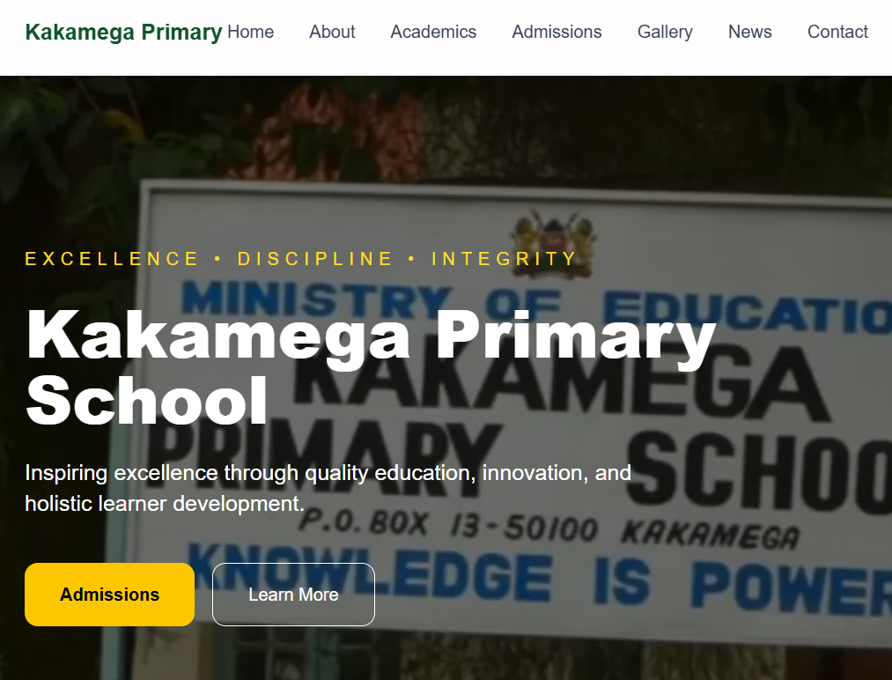
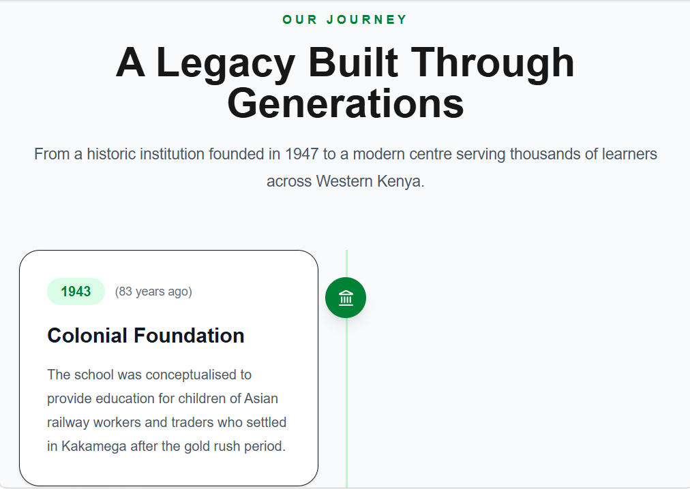
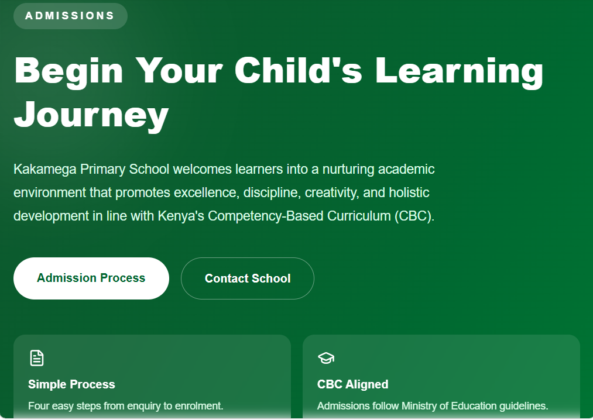
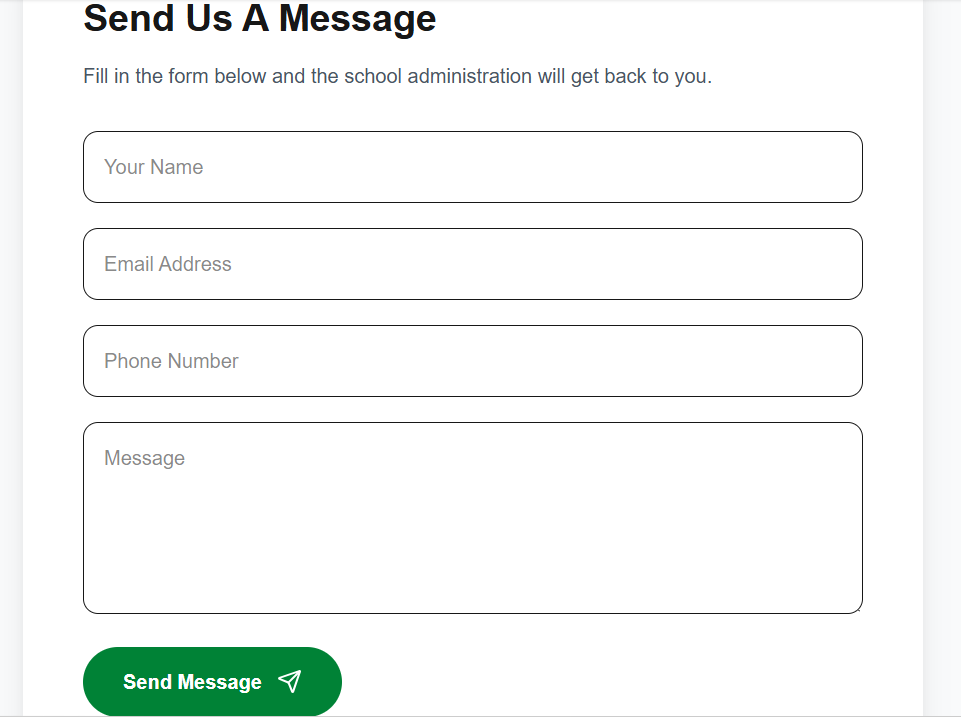

# Demo-site-Kakamega-primary-school
A modern, responsive website developed for a primary school to provide an engaging online presence for students, parents, teachers, and visitors.

> **Note:** This repository is for demonstration purposes only. The source code is private and is not included.

## 🌐 Live Demo

🔗 https://kakamega-primary-school.vercel.app/

## ✨ Features

- Responsive design
- Modern and accessible user interface
- School information pages
- Admissions section
- Academics overview
- News & announcements
- Gallery
- Contact page

## 🛠️ Technologies Used

- React
- TypeScript
- Tailwind CSS
- Vite
- Vercel (Deployment)

## 📸 Preview

### Home Page

### About Page

### Admissions

### Contact

## Source Code

The complete source code is maintained in a **private repository** and is not publicly available.

If you'd like to discuss this project or request a similar website, feel free to get in touch.

---

© 2026 • Demo Repository
